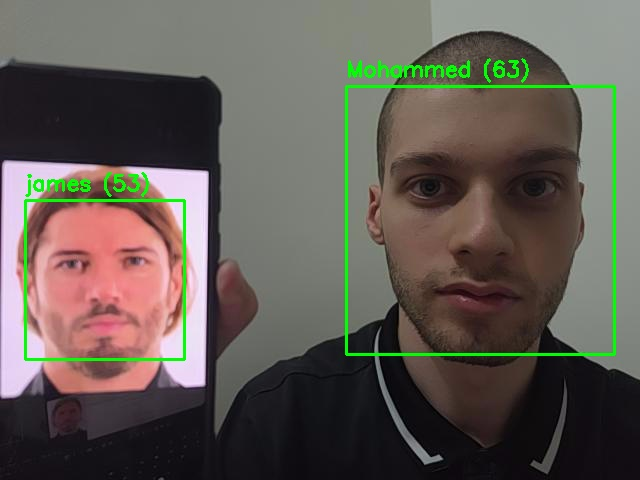

# ST-2026 — OpenCV Face Detection & Recognition

Detects human faces in images and live webcam video using Haar cascades, and identifies
*who* a detected face belongs to using LBPH.

SmartMethods ST-2026, Task 1 — *Make a project using OpenCV*.

## It works



Two people in one frame, each matched to the right name. The numbers are distances —
lower is a better match, and anything at or above `70` would be rejected as `Unknown`.

This is the whole point of the project in one image: the cascade found *two* faces, and
LBPH then decided *which* was which rather than giving them both the same label.

## Detection and recognition are two different jobs

This trips people up, so it is worth stating plainly:

| | Question it answers | Technique | Needs training? |
|---|---|---|---|
| **Detection** | *Where* is there a face? | Haar cascade | No |
| **Recognition** | *Whose* face is it? | LBPH | Yes |

Detection finds a face without knowing whose it is. Recognition takes a face that has
already been found and puts a name to it. This project does both, in that order.

## Setup

```bash
git clone https://github.com/Sniper797/ST-2026-OpenCV-Face-Recognition.git
cd ST-2026-OpenCV-Face-Recognition
pip install -r requirements.txt
```

**You must use `opencv-contrib-python`, not `opencv-python`.** The LBPH recognizer lives in
`cv2.face`, which only ships in the contrib build. The two packages install into the same
`cv2` namespace and conflict, so exactly one may be installed. If you already have plain
`opencv-python`:

```bash
pip uninstall -y opencv-python
pip install opencv-contrib-python==4.13.0.92
```

Verify:

```bash
python -c "import cv2; print(cv2.__version__, hasattr(cv2, 'face'))"
# 4.13.0 True
```

## Usage

### 1. Detect faces in an image

Works immediately — no training required.

```bash
$ python src/detect_image.py photo.jpg
Found 4 face(s)
```

Save the annotated result instead of displaying it:

```bash
$ python src/detect_image.py photo.jpg -o result.jpg
Found 4 face(s)
Saved to result.jpg
```

### 2. Build a dataset

Run once per person. **You need at least two people** — see the limitations below.

```bash
$ python src/capture_dataset.py Mohammed -n 30
Capturing 30 images for 'Mohammed'.
SPACE = capture, 'a' = toggle auto-capture, 'q' = quit
  saved 000.jpg
  saved 001.jpg
  skipped - need exactly 1 face, saw 0
  ...
Saved 30 images to dataset/Mohammed
```

Move your head between captures — vary angle and expression. Thirty near-identical frames
teach the recognizer far less than thirty varied ones. Auto-capture is throttled to one
image every `CAPTURE_INTERVAL` seconds for the same reason: an unthrottled burst fills the
dataset with copies of a single pose.

Frames containing zero faces or more than one face are skipped rather than saved. A single
wrong face in a folder silently corrupts training, and it is very hard to notice afterwards.

**Inspect what you captured before training.** The guard above catches ambiguous frames, but
it cannot catch a cascade false positive — a crop of an eyebrow or a nostril is exactly one
"face" as far as the detector is concerned. Building this project's own dataset produced two
such frames out of sixty; both were deleted by hand before training.

Add or remove people at any time, then re-run the training step. `train_model.py` rebuilds
from scratch over every folder in `dataset/`, which also reassigns the numeric label IDs —
that is why `labels.json` is written alongside the model. **The two files are a matched pair.**
Use one with the other and you get confident predictions carrying the wrong names.

### 3. Train

Real output from this project's own run:

```bash
$ python src/train_model.py
  james: 29 images (id=0)
  Mohammed: 29 images (id=1)
Trained on 58 images across 2 people.
Model:  models/lbph_model.yml
Labels: models/labels.json
```

### 4. Recognize live

```bash
$ python src/recognize_live.py
Running. Press 's' to save a screenshot, 'q' to quit.
  saved recognition_001.jpg
```

A green box with a name means a confident match. A red `Unknown` box means the face was
detected but not matched to anyone in the dataset. The number beside the name is the
distance — see below.

`s` writes the annotated frame to `docs/screenshots/`, numbered so it never overwrites an
earlier shot. The screenshot at the top of this README was produced that way. Keys only
register while the video window has focus.

Every script takes `-c` to pick a camera:

```bash
$ python src/recognize_live.py -c 1
```

## How it works

**Haar cascades** slide a window across the image at many scales, and at each position apply
a cascade of simple contrast comparisons — "is this region darker than that one?" The regions
are chosen during training to reflect how light falls on a face: the eye sockets are darker
than the cheeks, the bridge of the nose is brighter than the eyes on either side. Most
windows are rejected within the first few tests, which is what makes it fast enough for video.

**LBPH** (Local Binary Patterns Histograms) describes each face by comparing every pixel with
its neighbours, producing a texture code per pixel. Those codes are histogrammed over a grid
of regions, and the concatenated histograms form the face's signature. Recognition is then a
nearest-neighbour search against the signatures learned during training.

**Normalization.** Before training or matching, every face is cropped to its detection box,
converted to grayscale, resized to 200×200, and histogram-equalized. The resize is mandatory —
LBPH requires uniform input dimensions and fails outright otherwise. Equalization stretches
the contrast range, which reduces the effect of differing lighting.

### Confidence is a distance, not a percentage

`recognizer.predict()` returns `(label_id, confidence)` where **confidence is a distance:
lower means a better match, and `0.0` is a perfect match.**

This is the single easiest thing to get wrong in this project. Reading it as "percent
confident" inverts the logic and produces a system that assigns names to strangers and
rejects the people it was trained on. Matches at or above `CONFIDENCE_THRESHOLD` (default
`70.0`, in `src/config.py`) are reported as `Unknown`.

That default is a starting point, not a universal value. Tune it against your own camera and
lighting: if strangers get names, lower it; if you get `Unknown`, raise it.

### Measured results

Trained on 58 images across 2 people, threshold `70`:

| Subject | Distance | Verdict |
|---|---|---|
| Mohammed — same camera used for training | ~40 | matched |
| Mohammed — **different** camera | 63–66 | matched, but barely |
| james | 50–53 | matched |
| 4 strangers, never enrolled | 89–99 | all correctly `Unknown` |

Two things are worth reading off that table.

**The negative case passes.** All four unenrolled faces were rejected, with a wide gap
between them and the enrolled ones. A recognizer that names everyone would also pass a
positive-only test, so this check is what makes the positive result meaningful.

**Swapping cameras cost 24 points of margin.** The same face, minutes apart, scored ~40 on
the camera it was trained on and 63–66 on a different one — still under the threshold, but
with only 4 points to spare instead of 30. Nothing about the model or the person changed;
only the sensor and its lighting did. This is the lighting sensitivity in the limitations
below, quantified. The fix is to recapture on the camera you actually intend to use — **not**
to raise the threshold, which would buy margin by letting strangers in.

## Project structure

```
src/config.py           Paths and tunable constants
src/faces.py            Core logic — detection, normalization, label decisions
src/detect_image.py     Detect faces in a still image
src/capture_dataset.py  Capture training images from the webcam
src/train_model.py      Train the LBPH recognizer
src/recognize_live.py   Live recognition
tests/test_faces.py     Unit tests for the core
```

All the real logic lives in `faces.py`; the four scripts are thin wrappers. That split exists
so the logic can be tested — anything inside a webcam loop cannot be.

```bash
python -m pytest tests/ -v
```

## The problem we hit, and how we fixed it

Partway through this project every cascade-based script broke at once:

```
AttributeError: module 'cv2' has no attribute 'CascadeClassifier'
```

**Cause.** A notebook cell containing `pip install opencv-python` — unpinned — installed
**opencv-python 5.0.0.93**. OpenCV 5.0 removed `cv2.CascadeClassifier` entirely and shipped
an empty `cv2/data/` directory, with none of the bundled Haar cascade XML files that every
tutorial depends on. Code that had worked for weeks stopped working, without a single line
of it being edited.

**Why it was confusing.** The notebook's saved output still showed a successful run
(`Faces: 1`, `Eyes: 2`). That output was cached from an earlier run under OpenCV 4.x, so the
file looked perfectly healthy while the environment beneath it had changed. A notebook that
reports success but errors when you run it is a strong hint that its saved output is stale.

**How we diagnosed it.** Rather than guessing, we checked what actually existed at runtime:

- `cv2.CascadeClassifier` was absent from `cv2`, `cv2.objdetect`, and `cv2.legacy` — not
  moved, removed.
- `cv2.data.haarcascades` still returned a path, but the directory held only `__init__.py`.
  The XML files were gone, so even a manually downloaded cascade had no loader to use it.
- The package's install timestamp matched the day the breakage appeared.

**Fix.** Pin to the 4.x line:

```bash
pip install opencv-contrib-python==4.13.0.92
```

That restores `CascadeClassifier` and all 17 bundled cascades.

**The lesson.** Every dependency in this project is pinned as a result. An unpinned install
is a time bomb: it works right up until the maintainers ship a major version, and then it
breaks code you never touched — usually at the least convenient moment.

## Limitations

Stated honestly, because knowing where a technique fails is part of understanding it.

- **Haar cascades produce false positives.** Measured on this project's own test images: a
  photo of a cat registers one "face" with the human face cascade. The technique matches
  contrast patterns, and it has no concept of what a face actually is.
- **Frontal faces only.** Turn your head far enough and detection fails.
  `haarcascade_frontalface_default.xml` is trained on faces looking at the camera.
- **LBPH is sensitive to lighting and to the camera itself.** Histogram equalization helps
  but does not eliminate it. Measured here: switching to a different webcam moved the same
  person's distance from ~40 to 63–66 against a threshold of 70 — most of the safety margin,
  gone, with nothing changed but the sensor. Train on the camera you will actually use.
- **At least two people are required.** With one enrolled person LBPH has nothing to
  discriminate against, so it matches everyone to that single class. The threshold is then
  the only thing rejecting strangers, which is not enough.
- **This is not production face recognition.** Modern systems use deep-learning embeddings
  (FaceNet, ArcFace, or OpenCV's own `FaceRecognizerSF`), which are far more accurate and
  robust to pose and lighting. LBPH is a classical method, chosen here because it is
  transparent enough to understand end to end.

## Privacy

`dataset/` and `models/` are gitignored, so **no training images are published here** — clone
the repo and run `capture_dataset.py` to build your own locally. `docs/images/` is ignored
too, for throwaway output. `docs/screenshots/` is deliberately *not* ignored: it holds the
images used in this README.

This repository is public and git history is permanent. A face photo committed and then
deleted in a later commit remains retrievable from history — deleting the file does not undo
the publication. That makes committing an image of a person a decision to take deliberately
rather than by accident, which is why the two folders are separated and the ignored one is
the default.

The screenshot above is published by choice and shows the author. It also shows a second
face, used as the required second class during testing.

## Requirements

- Python 3.10+
- `opencv-contrib-python==4.13.0.92`
- A webcam, for capture and live recognition
